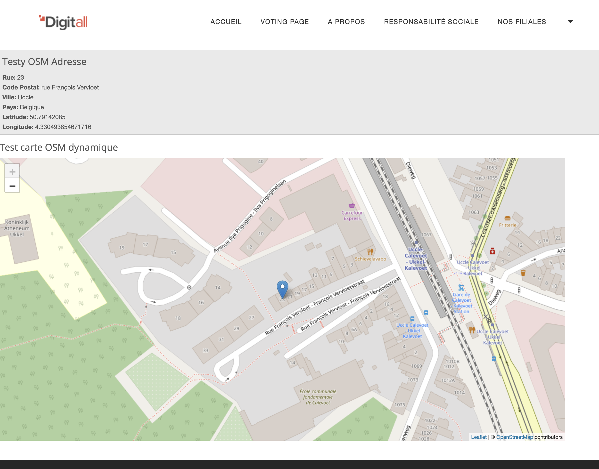

# openstreetmap
Open Source Map module alternative to Gmaps (based on OpenStreetMap geocoding and LeafLet JS for maps)

## Examples: 

### Satic Map version:

### Normal Map version: (with controls)

